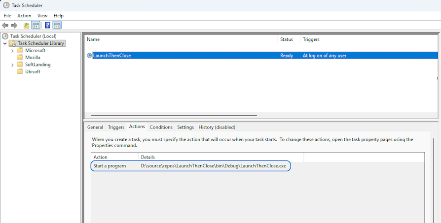

## 💻 Console - LaunchThenClose

**Dependencies**

| Assembly | Version |
| ---- | ---- |
| .NET | 4.8 |

### 📝 v1.0.0.0 - May 2026

* A helper utility that can launch an application on startup and then close it.
* There are 3 config settings that can be adjusted in the `Settings.xml` file:
    * `LaunchPath` - The full path of the process to start
    * `ProcessToKill` - The process name to kill once started
    * `DelaySeconds` - How long to wait for the app to start (in seconds)
* An example would be the **GCC** application for **AERO** graphic cards to apply settings that are not remembered from last session.
    * Full path: `C:\Program Files\GIGABYTE\Control Center\LaunchGCC.exe`
* Your first time running use the `--task true` switch to add it to *Window's* **TaskScheduler**.
    * The app will automatically check if the task exists and if not, it will create it for you. 
        * Equivalent to: `schtasks /create /tn "YourAppName AutoStart" /sc onlogon /tr "C:\Path\To\Application.exe" /rl highest /ru "%USERNAME%" /f`
* To remove the task just run again with `--task false`.
* I've also included a helpful `ScheduledTaskHelper` class that can be used to create a scheduled task to run any application on startup.

## 🧾 License/Warranty
* Permission is hereby granted, free of charge, to any person obtaining a copy of this software and associated documentation files (the "Software"), to deal in the Software without restriction, including without limitation the rights to use, copy, modify, merge, publish and distribute copies of the Software, and to permit persons to whom the Software is furnished to do so, subject to the following conditions: The above copyright notice and this permission notice shall be included in all copies or substantial portions of the Software.
* The software is provided "as is", without warranty of any kind, express or implied, including but not limited to the warranties of merchantability, fitness for a particular purpose and noninfringement. In no event shall the author or copyright holder be liable for any claim, damages or other liability, whether in an action of contract, tort or otherwise, arising from, out of or in connection with the software or the use or other dealings in the software.
* Copyright © 2026. All rights reserved.

## 📋 Proofing
* This application was compiled and tested using *VisualStudio* 2022 on *Windows 10/11* versions **22H2**, **21H2**, **21H1** and **25H2**.
